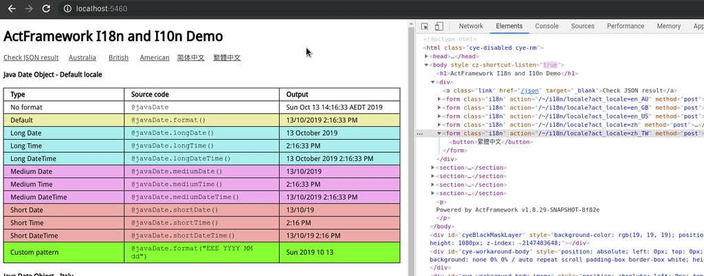

# I18n Demo

This app demonstrate how to do i18n in ActFramework application.

## Quick start

To start in dev mode:

```bash
cd /path/to/a/app
mvn clean compile exec:exec
```

To start in prod mode:

```bash
cd /path/to/a/app
mvn clean package
cd target/dist
unzip *.zip
./start
```

Once you started, navigate your browser to `http://localhost:5460` to play with the demo:



## Support [I18n and I10n](https://www.w3.org/International/questions/qa-i18n) in Actframework

It is super easy to add support to i18n and i10n in your ActFramework application.

First you need to enable i18n support by adding the following setting into your application configuration property file:

```properties
i18n=true
```

Then add your [messages bundle properties](https://github.com/act-gallery/i18n/tree/master/src/main/resources):


Finally coding your [HTML template](https://github.com/act-gallery/i18n/blob/master/src/main/resources/rythm/demo/i18n/AppEntry/home.html) 
using `@i18n` tag, e.g.

Localization of a Date is also quick easy to achieve by using rythm java extension to a date time variable in your
[template](https://github.com/act-gallery/i18n/blob/master/src/main/resources/beetl/demo/i18n/AppEntry/javaDateTable.html):

| Type |	Source code |	Sample |
| ---- | --- | --- |
| No format	| @javaDate	| Sun Oct 13 14:49:20 AEDT 2019
| Default	| @javaDate.format() |	Oct 13, 2019 2:49:20 PM
| Long Date	| @javaDate.longDate() |	October 13, 2019
| Long Time	| @javaDate.longTime() |	2:49:20 PM AEDT
| Long DateTime	| @javaDate.longDateTime() |	October 13, 2019 2:49:20 PM AEDT
| Medium Date	| @javaDate.mediumDate() |	Oct 13, 2019
| Medium Time	| @javaDate.mediumTime() |	2:49:20 PM
| Medium DateTime	| @javaDate.mediumDateTime() |	Oct 13, 2019 2:49:20 PM
| Short Date	| @javaDate.shortDate() |	10/13/19
| Short Time	| @javaDate.shortTime() |	2:49 PM
| Short DateTime	| @javaDate.shortDateTime() |	10/13/19 2:49 PM
| Custom pattern	| @javaDate.format("EEE YYYY MM dd") |	Sun 2019 10 13

## Change language/locale of current session

In order to change the language/locale of current session, it can simple send a POST request to the built in endpoint:  
`/~/i18n/locale?` with parameter named `act_locale`, that will set the language/locale of current session to the value
specified by `act_locale` parameter, e.g. `en_US` for Amercan English, and `zh_CN` for mainland China. 

In the [home template](https://github.com/act-gallery/i18n/blob/master/src/main/resources/rythm/demo/i18n/AppEntry/home.html)
we see the following code:

```html
<form class="i18n" action="/~/i18n/locale?act_locale=en_AU" method="post"><button>Australia</button></form>
<form class="i18n" action="/~/i18n/locale?act_locale=en_GB" method="post"><button>British</button></form>
<form class="i18n" action="/~/i18n/locale?act_locale=en_US" method="post"><button>American</button></form>
<form class="i18n" action="/~/i18n/locale?act_locale=zh" method="post"><button>简体中文</button></form>
<form class="i18n" action="/~/i18n/locale?act_locale=zh_TW" method="post"><button>繁體中文</button></form>
```

These code clearly demonstrate how you should do in your application in order to switch current user's language
locale setting.

**Note** once ActFramework handled the `POST /~/i18n/locale` request, it automatically redirect the user
back to the previous page where the request is initialized.

## Summary

- To enable i18n support, add `i18n=true` into your app configuration property file
- To add translate, add your `messages.properties` bundle
- To show i18n tokens, use `@i18n` tag of Rythm template
- To display localized date, use java extensions in Rythm template
- To change current user's language/locale, use `POST /~/i18n/locale` built in endpoint